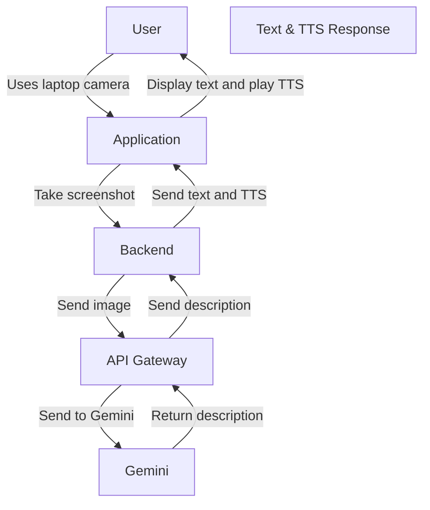

# Image Integration with CTk and Gemini



## Description
This project demonstrates video integration using CTk as the GUI framework and Gemini for multimodal testing with Text-to-Speech. The goal is to simulate a demo similar to the ChatGPT demo, showcasing video capabilities within a GUI environment.

## Installation
To get started with this project, follow these steps:

```python
git clone https://github.com/pour-le-hommes/Image-connection
cd testing_gemini_multimodal
pip install -r requirements.txt
```

Lastly:
add your GENAI_TEST_API_KEY to .env

```python
python main.py
```

## Usage
Once you have the application up and running, you can use it to integrate and manipulate videos within the GUI. This section can be expanded with more detailed usage instructions as the project evolves.

## Contributing
Contributions are welcome! If you have suggestions or improvements, please open an issue or submit a pull request.

## License
This project is licensed under the WTFPL (Do What the F*ck You Want to Public License).

## Authors
pour-le-terres (For the land)

## Acknowledgements
Special thanks to the creators of CTk and Gemini for their fantastic tools that made this project possible.
